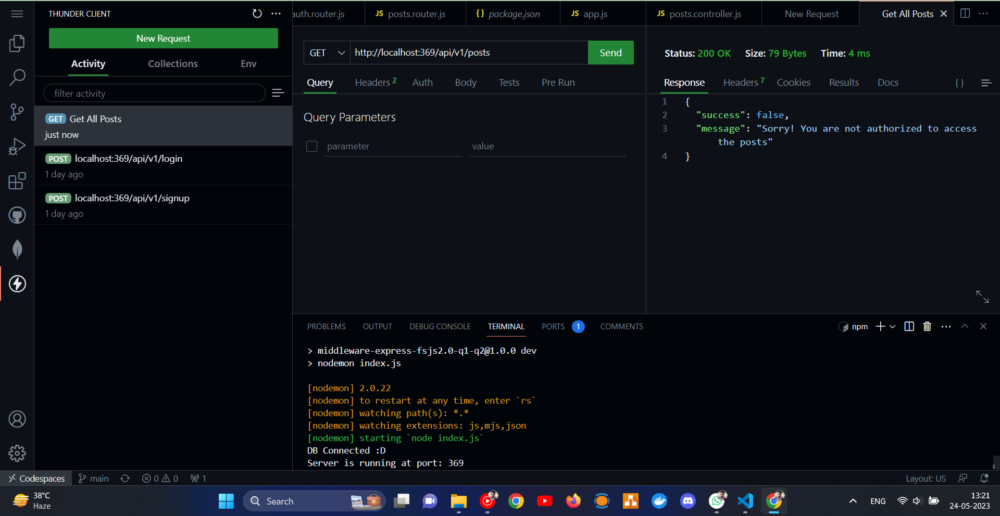
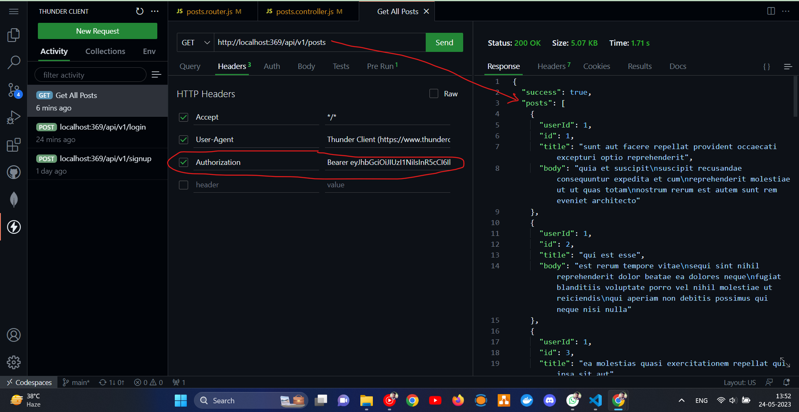

# middleware-express-fsjs2.0-Q1-Q2
iNeuron's FSJS 2.0 Placement Assignment - Express JS Project Q-01 and Q-02

### Implemented:
- I have created 3 End Points to implement the solution for Q01, Q02 They are:
    - `http://localhost:369/api/v1/posts/` => Which gives response of 20 posts which were fetched from FAKEJSONAPI in `./src/controllers/posts.controller.js`.
    - `http://localhost:369/api/v1/login/` => which gives cookie token as well as authorization bearer token... 
    - `http://localhost:369/api/v1/signup/`=> which gives cookie token as well as authorization bearer token...

- I have created a middleware in `./src/middlewares/isLoggedIn.middleware.js` to authorize an user before he can get response of 20 Posts. You can see my code in routers `./src/`, I have given the middleware before we hit `getAllPosts` function from `post.controller.js`.

### Output - Thunder Client
#### Posts Response without authorization beare token

#### Posts Response with authorization beare token

